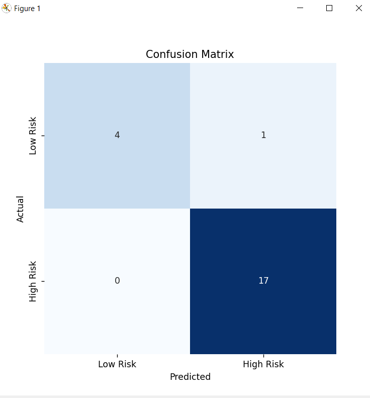

# capstone-custom
This is a project for my Data Analytics Capstone course

Github repository: https://github.com/Valpal84/capstone-custom

## Step 1: Clone github repository to your machine
- Open VS Code
- Use the command 'shift + ctrl + p' to git clone the repository to VS Code
- Copy the appropriate repository address to clone the appropriate repository

## Step 2: Create a .venv and activate virtual environment
 - In order to keep the project local in a virtual environment you'll need to create a .venv file. Please use the following steps to create the .venv. 
    -  open a new terminal
    - type code py -m venv .venv
 - Activte the .venv
    - type code .venv\Scripts\Activate

## Step 3: Install necessary packages
 - With the terminal open and the virtual environment activated install your necessary dependencies
     - type the following code py -m --upgrade -r requirements.txt

 Now that we have all of the necessary pre-work steps completed you can begin to unpack the project.

 ## Step 4: Viewing basic info
 - Open the basic_info.py file and run it, this file will show you the basic information contained within the data set and will give you a good basic idea of the information for the project

 ## Step 5:View linear regression using ML
 - Open the file machine_learning_regression.py and run it. Here you will see why the linear regression ML process was inappropriate for this dataset. This was my first try at creating a machine learning program to identify overall health risk. Due to poor performance and overfitting a different machine learning method was deemed necessary. 

 ## Step 6: Random Forest Classifier
 - Open the file ml_random_forest.py and run it, this is the final machine learning program created in order to train and test the dataset to determine whether or not an individual would have increased risk of overall health issues based on some of their current medical statistics and sleep issues. This model performed well with 95% accuracy. It correctly predicted a high number of "high risk" individuals based on information provided. 

Here are some charts from running the random forest code

 

 
